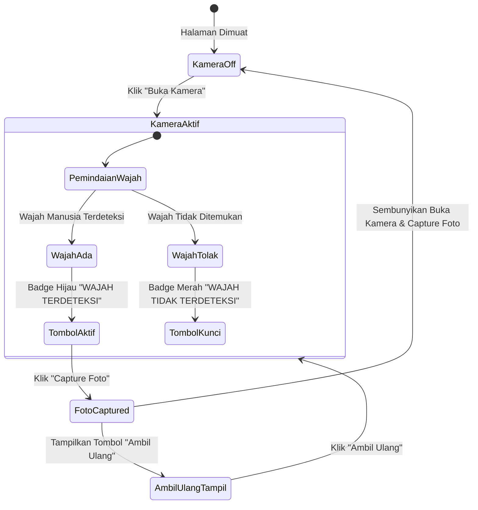

# Panduan & Dokumentasi Fitur Deteksi Wajah Real-Time (*Face Detection*)

Dokumen ini menjelaskan rancangan, alur kerja, teknologi, dan implementasi dari **Fitur Deteksi Wajah Real-Time (*Face Detection*)** pada sistem kamera formulir presensi publik.

---

## 📌 1. Latar Belakang & Tujuan

Fitur ini diterapkan untuk meningkatkan keabsahan dan integritas data presensi peserta.

* **Masalah**: Peserta berpotensi mengarahkan kamera ke tembok, lantai, barang, atau foto cetak mati saat mengambil foto presensi.
* **Solusi**: Sistem kamera dilengkapi modul *face detection* otomatis. Tombol **"Capture Foto"** dikunci (*disabled*) dan **hanya dapat diaktifkan apabila wajah manusia secara nyata terdeteksi** di depan kamera.

---

## 🏗️ 2. Arsitektur & Teknologi (*Multi-Engine Detection*)

Sistem menggunakan pendekatan **3-Layer Detection Engine** untuk menjamin deteksi cepat, akurat, dan tetap berfungsi meskipun jaringan internet pengguna sedang lambat atau *offline*:

| Layer | Teknologi Engine | Keterangan & Keunggulan |
| :--- | :--- | :--- |
| **Layer 1 (Utama)** | `window.FaceDetector` API | *Native Browser API* bawaan peramban modern (Chrome/Edge/Android). Sangat cepat karena diproses langsung oleh akselerasi perangkat keras (*hardware-accelerated*). |
| **Layer 2 (Cadangan CDN)** | `@vladmandic/face-api` (`TinyFaceDetector`) | Pustaka ringan berbasis TensorFlow.js yang dimuat via CDN. Mengeksekusi model neural network `TinyFaceDetector` berukuran hemat memori (~190KB). |
| **Layer 3 (Fallback Offline)** | *YCbCr Skin & Luminance Contour Analysis* | Algoritma analisis piksel warna kulit manusia dan persebaran kontur cahaya pada frame kamera. Menjamin sistem penguncian tombol **tetap berjalan 100% stabil meski dalam keadaan tanpa internet (offline)**. |

---

## 🔄 3. Alur Kerja & Interaksi UI (*UX Workflow*)

 visual alur status kamera dan tombol pada formulir presensi:



### 🎯 Penjelasan Detail Status Tombol & Badge Visual:

1. **Kondisi Kamera Mati (*Default*)**:
   * Tampil: Tombol **"Buka Kamera"** (Warna Biru).
   * Terapkan: Tombol **"Capture Foto"** terkunci & buram (*disabled + opacity-5*).

2. **Kondisi Kamera Aktif (*Scanning 300ms*)**:
   * Tombol **"Buka Kamera"** otomatis disembunyikan.
   * **Jika Wajah Terdeteksi**:
     * Badge mengambang (*floating transparent*): `<span class="badge bg-success">WAJAH TERDETEKSI</span>`.
     * Tombol **"Capture Foto"** menjadi **Aktif (Enabled)**.
   * **Jika Wajah Tidak Terdeteksi / Kamera Ditutup**:
     * Badge mengambang (*floating transparent*): `<span class="badge bg-danger">WAJAH TIDAK TERDETEKSI</span>`.
     * Tombol **"Capture Foto"** **Terkunci (Disabled)**. Jika diklik, sistem akan menampilkan pesan notifikasi:
       > *"Peringatan: Wajah tidak terdeteksi oleh kamera! Harap posisikan wajah Anda tepat di depan kamera."*

3. **Kondisi Foto Setelah Di-Capture**:
   * Frame kamera membeku (*freeze*) pada hasil foto.
   * Tombol **"Buka Kamera"** dan **"Capture Foto"** **Disembunyikan sepenuhnya (`d-none`)**.
   * Hanya tombol **"Ambil Ulang"** yang muncul di samping foto.
   * Klik tombol **"Ambil Ulang"** akan mereset canvas dan mengaktifkan kembali pemindaian kamera secara bersih.

---

## 📂 4. Berkas Kode Terkait

Seluruh logika tampilan HTML dan skrip JavaScript deteksi wajah dapat Anda temukan pada berkas berikut:

* **Tampilan & Logic**: `resources/views/presence/form.blade.php`
  * **Frame & Badge Overlay**: Baris `330 - 355`
  * **Deteksi Wajah JS (`startFaceDetection`)**: Baris `650 - 755`
  * **Fungsi Kamera & Tombol (`activateWebcam`, `snapPhoto`, `resetWebcamCapture`)**: Baris `756 - 835`

---

## 🧪 5. Cara Pengujian (*Verification Steps*)

1. Buka halaman formulir presensi publik salah satu event yang mengaktifkan fitur foto.
2. Klik tombol **"Buka Kamera"**.
3. Arahkan kamera ke tembok atau tutupi lensa kamera dengan tangan:
   * Perhatikan indikator berubah menjadi **"WAJAH TIDAK TERDETEKSI"**.
   * Pastikan tombol **"Capture Foto"** tidak bisa diklik.
4. Hadapkan wajah Anda tepat ke depan kamera:
   * Indikator akan berubah menjadi **"WAJAH TERDETEKSI"** dalam warna hijau.
   * Tombol **"Capture Foto"** menjadi aktif.
5. Klik **"Capture Foto"**:
   * Foto berhasil diambil.
   * Tombol **"Buka Kamera"** dan **"Capture Foto"** hilang.
   * Hanya tersisa tombol **"Ambil Ulang"**.

---

## ⚙️ 6. Penjelasan Logika Kode JavaScript (*Code Breakdown*)

Berikut adalah penjelasan teknis detail mengenai bagian kode JavaScript yang mengontrol fungsi deteksi wajah real-time pada formulir presensi:

```javascript
let activeStream = null;
let faceModelsLoaded = false;
let faceCheckInterval = null;
let isFacePresent = false;
```
* **`activeStream`**: Menyimpan objek aliran kamera aktif agar dapat dihentikan (stop camera device) ketika formulir presensi dikirim (*submit*).
* **`faceModelsLoaded`**: Penanda boolean (*flag*) untuk memverifikasi apakah model neural network dari FaceAPI telah selesai diunduh dan siap digunakan.
* **`faceCheckInterval`**: Menyimpan referensi penunjuk waktu interval (`setInterval`) pemindaian berulang agar dapat dihentikan saat kamera mati.
* **`isFacePresent`**: Menyimpan status mutakhir deteksi wajah (apakah saat ini wajah terdeteksi atau tidak).

---

```javascript
async function initFaceDetector() {
  if (window.FaceDetector) return true;
  if (typeof faceapi !== 'undefined' && !faceModelsLoaded) {
    try {
      const modelUrl = 'https://cdn.jsdelivr.net/npm/@vladmandic/face-api/model/';
      await faceapi.nets.tinyFaceDetector.loadFromUri(modelUrl);
      faceModelsLoaded = true;
      return true;
    } catch(e) {
      console.warn('FaceAPI CDN model failed to load:', e);
    }
  }
  return false;
}
```
* Fungsi asinkronus ini memuat *weights/model* deteksi sebelum pemindaian dilakukan.
* **Prioritas Pertama**: Menggunakan akselerasi peramban bawaan (`window.FaceDetector`) jika didukung oleh peramban pengguna (misal Chrome / Edge modern di Android/Desktop).
* **Prioritas Kedua**: Jika browser tidak mendukung native detector, ia akan memuat modul neural network ultra-ringan (`tinyFaceDetector`) dari repositori CDN jsDelivr ke memori lokal klien.

---

```javascript
function startFaceDetection(video) {
  const badge = document.getElementById('face-detection-badge');
  const badgeText = document.getElementById('face-status-text');
  const btnSnap = document.getElementById('btn-snap-photo');

  if(badge) badge.classList.remove('d-none');
  if(btnSnap) {
    btnSnap.disabled = true;
    btnSnap.classList.add('opacity-5');
  }
  isFacePresent = false;

  initFaceDetector().then(() => {
    if (faceCheckInterval) clearInterval(faceCheckInterval);

    faceCheckInterval = setInterval(async () => {
      if (!activeStream || video.paused || video.ended || video.classList.contains('d-none')) {
        clearInterval(faceCheckInterval);
        return;
      }

      let faceDetected = false;

      try {
        if (window.FaceDetector) {
          const detector = new window.FaceDetector({ fastMode: true, maxFaces: 5 });
          const faces = await detector.detect(video);
          faceDetected = faces && faces.length > 0;
        } else if (typeof faceapi !== 'undefined' && faceModelsLoaded) {
          const detections = await faceapi.detectAllFaces(video, new faceapi.TinyFaceDetectorOptions({ inputSize: 224, scoreThreshold: 0.35 }));
          faceDetected = detections && detections.length > 0;
        } else {
          faceDetected = analyzeFaceSkinContour(video);
        }
      } catch(e) {
        faceDetected = analyzeFaceSkinContour(video);
      }

      isFacePresent = faceDetected;

      if (faceDetected) {
        if (badgeText) {
          badgeText.innerHTML = '<span class="badge bg-success py-1 px-2 text-white"><i class="fas fa-user-check me-1"></i> Wajah Terdeteksi</span>';
        }
        if (btnSnap) {
          btnSnap.disabled = false;
          btnSnap.classList.remove('opacity-5');
        }
      } else {
        if (badgeText) {
          badgeText.innerHTML = '<span class="badge bg-danger py-1 px-2 text-white"><i class="fas fa-user-slash me-1"></i> Wajah Tidak Terdeteksi</span>';
        }
        if (btnSnap) {
          btnSnap.disabled = true;
          btnSnap.classList.add('opacity-5');
        }
      }
    }, 300);
  });
}
```
* **Inisialisasi**: Menyembunyikan tombol capture (`disabled = true`) dan menampilkan status pencarian awal.
* **Interval Loop (300ms)**: Setiap 300ms, frame aktif dari video kamera dikirim ke mesin detektor.
* **Proses Deteksi Bertingkat**:
  1. Detektor native browser dijalankan.
  2. Jika browser tidak mendukung, detektor AI FaceAPI (`TinyFaceDetectorOptions` dengan ambang keyakinan `0.35`) dijalankan.
  3. Jika gagal memuat model (misal offline), algoritma pemindai kontur piksel kulit (`analyzeFaceSkinContour`) dijalankan sebagai pelindung fallback terakhir.
* **Perubahan Status UI**:
  * Jika wajah ditemukan, badge berubah menjadi **Sukses (Hijau)** dan kunci tombol capture dibuka.
  * Jika wajah hilang, badge berubah menjadi **Bahaya (Merah)** dan tombol kembali dikunci.

---

```javascript
function analyzeFaceSkinContour(video) {
  const canvas = document.createElement('canvas');
  canvas.width = 160;
  canvas.height = 120;
  const ctx = canvas.getContext('2d');
  ctx.drawImage(video, 0, 0, 160, 120);
  const imgData = ctx.getImageData(0, 0, 160, 120);
  const data = imgData.data;

  let skinPixels = 0;
  for (let i = 0; i < data.length; i += 4) {
    const r = data[i], g = data[i+1], b = data[i+2];
    const cb = 128 - 0.168736 * r - 0.331264 * g + 0.5 * b;
    const cr = 128 + 0.5 * r - 0.418688 * g - 0.081312 * b;
    if (r > 60 && g > 40 && b > 20 && (r - Math.min(g, b)) > 15 && Math.abs(r - g) > 15 && cr > 135 && cr < 180 && cb > 85 && cb < 135) {
      skinPixels++;
    }
  }
  const ratio = skinPixels / (160 * 120);
  return ratio >= 0.08 && ratio <= 0.70;
}
```
* Algoritma cadangan offline berbasis analisis spektrum piksel warna kulit.
* **Metode**:
  1. Menyalin frame webcam ke canvas virtual mini berukuran `160px x 120px`.
  2. Mengekstrak warna RGB piksel, lalu dikonversi ke format **YCbCr** (sistem warna penentu kecerahan & krominasi).
  3. Memfilter piksel kulit menggunakan rentang krominasi warna merah kulit manusia (`135 < Cr < 180`) dan krominasi warna biru kulit manusia (`85 < Cb < 135`).
  4. Menghitung porsi/rasio warna kulit. Jika area kulit terdeteksi mencakup antara **8% hingga 70%** dari total bidang tangkapan, disimpulkan terdapat wajah manusia di depan kamera.
