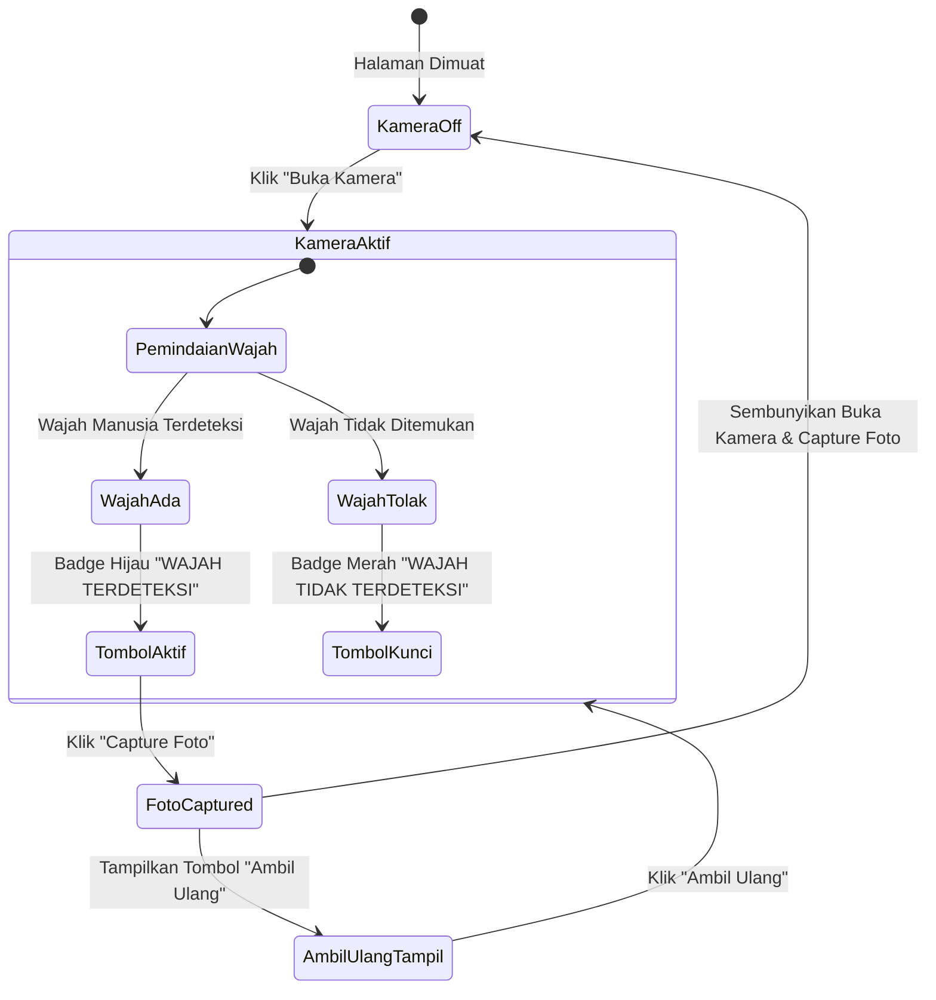

# Panduan & Dokumentasi Fitur Deteksi Wajah Real-Time (*Face Detection*)

Dokumen ini menjelaskan rancangan, alur kerja, teknologi, dan implementasi dari **Fitur Deteksi Wajah Real-Time (*Face Detection*)** pada sistem kamera formulir presensi publik.

---

## 📌 1. Latar Belakang & Tujuan

Fitur ini diterapkan untuk meningkatkan keabsahan dan integritas data presensi peserta.

* **Masalah**: Peserta berpotensi mengarahkan kamera ke tembok, lantai, barang, atau foto cetak mati saat mengambil foto presensi.
* **Solusi**: Sistem kamera dilengkapi modul *face detection* otomatis. Tombol **"Capture Foto"** dikunci (*disabled*) dan **hanya dapat diaktifkan apabila wajah manusia secara nyata terdeteksi** di depan kamera.

---

## 🏗️ 2. Arsitektur & Teknologi (*Multi-Engine Detection*)

Sistem menggunakan pendekatan **3-Layer Detection Engine** untuk menjamin deteksi cepat, akurat, dan tetap berfungsi meskipun jaringan internet pengguna sedang lambat atau *offline*:

| Layer | Teknologi Engine | Keterangan & Keunggulan |
| :--- | :--- | :--- |
| **Layer 1 (Utama)** | `window.FaceDetector` API | *Native Browser API* bawaan peramban modern (Chrome/Edge/Android). Sangat cepat karena diproses langsung oleh akselerasi perangkat keras (*hardware-accelerated*). |
| **Layer 2 (Cadangan CDN)** | `@vladmandic/face-api` (`TinyFaceDetector`) | Pustaka ringan berbasis TensorFlow.js yang dimuat via CDN. Mengeksekusi model neural network `TinyFaceDetector` berukuran hemat memori (~190KB). |
| **Layer 3 (Fallback Offline)** | *YCbCr Skin & Luminance Contour Analysis* | Algoritma analisis piksel warna kulit manusia dan persebaran kontur cahaya pada frame kamera. Menjamin sistem penguncian tombol **tetap berjalan 100% stabil meski dalam keadaan tanpa internet (offline)**. |

---

## 🔄 3. Alur Kerja & Interaksi UI (*UX Workflow*)

 visual alur status kamera dan tombol pada formulir presensi:

### 🎯 Penjelasan Detail Status Tombol & Badge Visual:

1. **Kondisi Kamera Mati (*Default*)**:
   * Tampil: Tombol **"Buka Kamera"** (Warna Biru).
   * Terapkan: Tombol **"Capture Foto"** terkunci & buram (*disabled + opacity-5*).

2. **Kondisi Kamera Aktif (*Scanning 300ms*)**:
   * Tombol **"Buka Kamera"** otomatis disembunyikan.
   * **Jika Wajah Terdeteksi**:
     * Badge mengambang (*floating transparent*): `WAJAH TERDETEKSI`.
     * Tombol **"Capture Foto"** menjadi **Aktif (Enabled)**.
   * **Jika Wajah Tidak Terdeteksi / Kamera Ditutup**:
     * Badge mengambang (*floating transparent*): `WAJAH TIDAK TERDETEKSI`.
     * Tombol **"Capture Foto"** **Terkunci (Disabled)**. Jika diklik, sistem akan menampilkan pesan notifikasi:
       > *"Peringatan: Wajah tidak terdeteksi oleh kamera! Harap posisikan wajah Anda tepat di depan kamera."*

3. **Kondisi Foto Setelah Di-Capture**:
   * Frame kamera membeku (*freeze*) pada hasil foto.
   * Tombol **"Buka Kamera"** dan **"Capture Foto"** **Disembunyikan sepenuhnya (`d-none`)**.
   * Hanya tombol **"Ambil Ulang"** yang muncul di samping foto.
   * Klik tombol **"Ambil Ulang"** akan mereset canvas dan mengaktifkan kembali pemindaian kamera secara bersih.

---

## 📂 4. Berkas Kode Terkait

Seluruh logika tampilan HTML dan skrip JavaScript deteksi wajah dapat Anda temukan pada berkas berikut:

* **Tampilan & Logic**: `resources/views/presence/form.blade.php`
  * **Frame & Badge Overlay**: Baris `330 - 355`
  * **Deteksi Wajah JS (`startFaceDetection`)**: Baris `650 - 755`
  * **Fungsi Kamera & Tombol (`activateWebcam`, `snapPhoto`, `resetWebcamCapture`)**: Baris `756 - 835`

---

## 🧪 5. Cara Pengujian (*Verification Steps*)

1. Buka halaman formulir presensi publik salah satu event yang mengaktifkan fitur foto.
2. Klik tombol **"Buka Kamera"**.
3. Arahkan kamera ke tembok atau tutupi lensa kamera dengan tangan:
   * Perhatikan indikator berubah menjadi **"WAJAH TIDAK TERDETEKSI"**.
   * Pastikan tombol **"Capture Foto"** tidak bisa diklik.
4. Hadapkan wajah Anda tepat ke depan kamera:
   * Indikator akan berubah menjadi **"WAJAH TERDETEKSI"** dalam warna hijau.
   * Tombol **"Capture Foto"** menjadi aktif.
5. Klik **"Capture Foto"**:
   * Foto berhasil diambil.
   * Tombol **"Buka Kamera"** dan **"Capture Foto"** hilang.
   * Hanya tersisa tombol **"Ambil Ulang"**.
