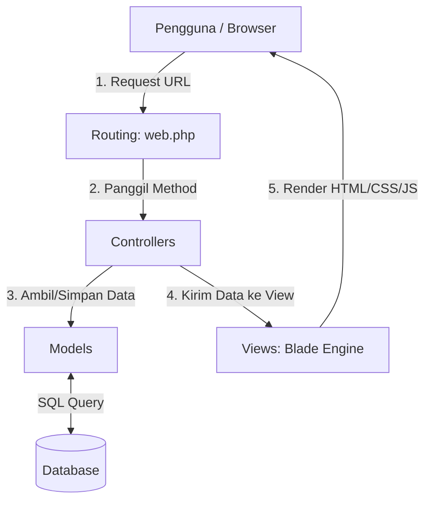
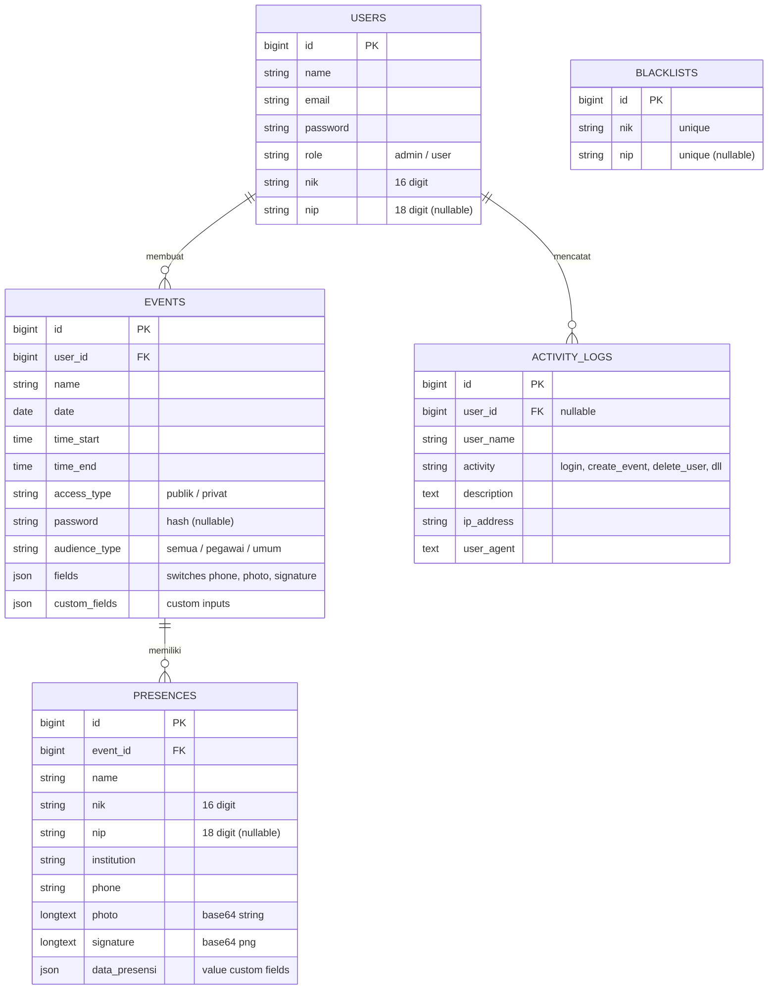

# PANDUAN PEMBUATAN SISTEM E-PRESENSI DISKOMINFO
*Dokumen Panduan Teknis Lengkap untuk Bahan Presentasi Hari Senin*

Sistem E-Presensi ini dirancang menggunakan framework **Laravel 11** dengan arsitektur MVC (Model-View-Controller). Sistem ini menangani pembuatan event presensi (publik/privat), input dinamis berbasis kategori peserta (Pegawai vs Umum), verifikasi NIK/NIP otomatis, audit log keamanan, serta rekapitulasi data kehadiran yang dapat diekspor ke Excel secara interaktif.

---

## 1. ARSITEKTUR MVC (Model - View - Controller)
Laravel menerapkan pola arsitektur MVC untuk memisahkan logika bisnis (Controller), struktur data/database (Model), dan tampilan antarmuka pengguna (View).



### A. Model (Representasi Tabel Database)
Terletak pada folder `app/Models/`. Model bertugas mengatur struktur data, casting JSON, dan relasi antar tabel:
* **`User.php`**: Mengelola data pengguna (Admin & Staff Pembuat Event).
* **`Event.php`**: Mengelola agenda kegiatan presensi, casting kolom JSON (`fields` & `custom_fields`), serta menyajikan status keaktifan form (`status_absensi`).
* **`Presence.php`**: Mengelola data absensi peserta (NIK, NIP, Nama, Foto, Tanda Tangan, dll).
* **`Blacklist.php`**: Menyimpan daftar NIK & NIP yang diblokir untuk pendaftaran maupun akses masuk.
* **`ActivityLog.php`**: Menyimpan jejak audit sistem (Audit Trail/Log Aktivitas) seperti login, buat event, atau percobaan masuk ilegal.

### B. View (User Interface & Layouts)
Terletak pada folder `resources/views/`. Menggunakan **Blade Templating Engine** untuk menyajikan antarmuka:
* **`layouts/app.blade.php`**: Template induk dashboard admin/user menggunakan aset tema **Argon Dashboard 2**.
* **`auth/login.blade.php` & `register.blade.php`**: Form masuk dan pendaftaran user baru.
* **`presence/form.blade.php`**: Halaman pengisian presensi publik dengan kamera capture (webcam) dan canvas tanda tangan digital.
* **`dashboard/admin.blade.php` & `user.blade.php`**: Panel kendali untuk admin dan user staff.
* **`dashboard/presences.blade.php`**: Tabel interaktif rekap kehadiran per event (menggunakan Simple Datatables).

### C. Controller (Logika Bisnis & Alur Kerja)
Terletak pada folder `app/Http/Controllers/`. Tempat di mana semua aturan sistem diproses:
* **`AuthController.php`**: Menangani otentikasi login (termasuk blokir blacklist), pendaftaran user baru, dan logout.
* **`PresenceController.php`**: Mengatur validasi form presensi, filter waktu keaktifan, pengisian sandi event privat, pemetaan NIP ke instansi, dan penyimpanan data presensi.
* **`DashboardController.php`**: Menangani pembuatan event oleh admin/user, manajemen user, pemblokiran NIK/NIP, penyajian data log, penyajian biner foto/ttd publik, serta ekspor file rekap Excel.

---

## 2. STRUKTUR DATABASE & RELASI TABEL



---

## 3. ALUR KERJA & LOGIKA UTAMA SISTEM

### A. Alur Deteksi Keaktifan Event (Landing Page)
1. Tamu mengakses root URL (`/`).
2. Sistem mendeteksi waktu saat ini di zona waktu **`Asia/Jakarta`**.
3. Sistem memfilter data event: **Hanya menampilkan kartu event yang tanggalnya hari ini dan waktu saat ini belum melewati waktu selesai (`time_end`)**.
4. Event yang belum mulai tetap ditampilkan agar peserta tahu jadwalnya, tetapi form presensi belum bisa diakses.
5. Event yang sudah melewati `time_end` otomatis disembunyikan dari landing page.

### B. Validasi Kategori Peserta (Pegawai vs Umum)
Tipe akses audiens dikendalikan secara dinamis pada halaman form presensi:
* **Masyarakat Umum:** Cukup menginputkan **NIK (16 digit)**. Input NIP disembunyikan dan bersifat opsional. Kolom instansi diisi manual oleh peserta atau default ke "Masyarakat Umum".
* **Pegawai Pemerintah:** Wajib menginputkan **NIK (16 digit)** dan **NIP (18 digit)**. 
* **Pencocokan Database Pegawai:** Backend mencocokkan NIP yang diinput dengan database pegawai internal (mocking database). Jika terdaftar (misal NIP Dinas Kominfo), nama Instansi otomatis diset sesuai dinasnya. Jika tidak terdaftar, otomatis diset ke "Pemerintah Kota Malang".

### C. Alur Pengamanan Blacklist di Login & Register
* **Saat Register:** Sistem memvalidasi apakah NIK/NIP pendaftar ada di tabel `blacklists`. Jika ada, registrasi digagalkan secara paksa.
* **Saat Login:** Setelah kredensial email/sandi lolos verifikasi, sistem memeriksa NIK/NIP milik user tersebut ke tabel `blacklists`. Jika terdaftar, sistem akan langsung me-log out user, merusak session, mencatat upaya masuk di log (`login_blocked`), dan mengembalikan ke form login dengan pesan akun ditangguhkan.
* **Saat Hapus User:** Ketika admin menghapus user dengan tombol "Hapus + Blacklist", sistem secara otomatis mendaftarkan NIK/NIP user tersebut ke tabel `blacklists` terlebih dahulu (menggunakan logika aman `firstOrCreate` agar tidak terjadi duplikasi crash database) baru kemudian menghapus data user tersebut.

### D. Sistem Audit Log Aktivitas (Log Keamanan)
Setiap aksi penting mencatat log biner ke database melalui static helper `ActivityLog::log($activity, $description)`:
* **Login/Logout/Register**
* **Percobaan login ilegal dari user ter-blacklist** (`login_blocked`)
* **Pembuatan & Penghapusan Event** oleh Pembuat / Admin
* **Pengisian Presensi** oleh Tamu / Peserta
* **Penambahan & Pemulihan Blacklist** oleh Admin

Log ini ditampilkan pada dashboard Admin menggunakan Datatable yang mendukung pencarian cepat untuk memantau jika ada anomali atau percobaan perusakan sistem.

### E. Tautan Ekspor Excel & Rendering Gambar
* Ekspor dilakukan via stream response bertipe `application/vnd.ms-excel` yang mem-render tabel HTML mentah.
* Kolom NIK dan NIP dipaksa berupa string dengan menambahkan kutip satu (`'{{ $presence->nik }}`) agar Excel tidak mengubahnya menjadi format ilmiah eksponensial.
* Karena Excel memblokir rendering gambar berbasis Base64 langsung (`` dengan tag `data:image...` disilang merah `[x]`), kolom foto dan tanda tangan dialihkan berupa tag `` yang bersumber dari rute publik biner (`route('presence.photo')` dan `route('presence.signature')`). Selama server lokal Laravel berjalan, Excel akan mengunduh data biner gambar lewat URL tersebut secara otomatis dan langsung menampilkannya secara visual di dalam sel tabel.

---

## 4. LANGKAH-LANGKAH KONFIGURASI DARI AWAL HINGGA AKHIR

### Langkah 1: Inisialisasi & Setup Lingkungan (.env)
1. Buat database baru di MySQL atau gunakan SQLite.
2. Atur kredensial koneksi database pada file `.env` di root project:
   ```env
   DB_CONNECTION=mysql
   DB_HOST=127.0.0.1
   DB_PORT=3306
   DB_DATABASE=epresensi_diskominfo
   DB_USERNAME=root
   DB_PASSWORD=
   ```
3. Atur zona waktu aplikasi di file `config/app.php` ke `'Asia/Jakarta'`.

### Langkah 2: Pembuatan Migration & Model
Gunakan Artisan untuk membuat tabel database dan modelnya:
```bash
# Membuat model & migration secara bersamaan
php artisan make:model Event -m
php artisan make:model Blacklist -m
php artisan make:model Presence -m
php artisan make:model ActivityLog -m
```
Sesuaikan fungsi `up()` pada setiap berkas migrasi di `database/migrations/` seperti spesifikasi skema di atas, kemudian jalankan migrasi database:
```bash
php artisan migrate:fresh --seed
```
*(Catatan: `--seed` digunakan untuk mengisi user admin default secara otomatis dari `DatabaseSeeder.php`)*.

### Langkah 3: Konfigurasi Routing (`routes/web.php`)
Daftarkan rute akses sistem dengan membaginya ke dalam 3 kelompok utama:
1. **Akses Publik Bebas:** Halaman utama (`/`), Form Presensi (`/presence/form/{id}`), Submit Presensi, dan Link Gambar (`/presence/{id}/photo` dan `/presence/{id}/signature`).
2. **Akses Dashboard Ter-autentikasi (`auth`):** Dashboard user staff (`/dashboard`), Buat Event, Hapus Event, dan Rekap Presensi.
3. **Akses Khusus Super Admin (`auth` & `role:admin`):** Dashboard admin (`/admin/dashboard`), Tambah/Hapus User, dan Tambah/Hapus Blacklist.

### Langkah 4: Inisialisasi Datatables di Sisi Client (Frontend)
Untuk mempercantik dan mempercepat pencarian data tanpa reload, sertakan pustaka datatables vanilla javascript (Simple Datatables) bawaan Argon Dashboard di setiap halaman dashboard:
1. Sertakan file JS di bagian skrip:
   ```html
   <script src="{{ asset('assets/argon-dashboard-pro-html-v2.0.5/assets/js/plugins/datatables.js') }}"></script>
   ```
2. Lakukan inisialisasi di JavaScript:
   ```javascript
   document.addEventListener('DOMContentLoaded', () => {
     new simpleDatatables.DataTable("#id-tabel-anda", {
       searchable: true,
       fixedHeight: false,
       perPage: 10,
       perPageSelect: false // Menyembunyikan pilihan limit halaman
     });
   });
   ```

---

## 5. FITUR UNGGULAN UNTUK BAHAN PRESENTASI (HIGHLIGHTS)
Saat presentasi di hadapan pembimbing lapangan dan penguji, tekankan poin-poin keunggulan sistem berikut:
1. **Sistem Proteksi Berlapis (Blacklist):** Tidak hanya mencegah pendaftaran user baru, tetapi juga langsung menendang keluar (*force logout*) user ter-blacklist yang nekat mencoba masuk melalui form login.
2. **Keamanan Audit Trail (Log Sistem):** Seluruh rekaman jejak digital sistem disimpan aman dalam tabel database log yang terintegrasi, bukan lagi sekadar file teks log framework yang sulit diakses.
3. **Fleksibilitas Input Dinamis:** Formulir presensi dapat dikonfigurasi secara instan oleh pembuat event untuk memunculkan input custom (seperti no HP, foto wajah, tanda tangan) tanpa perlu menulis baris kode baru di database.
4. **Keandalan Waktu (Time-Locking):** Waktu akses presensi dikunci ketat berbasis server menggunakan timezone `'Asia/Jakarta'`, memastikan tidak ada manipulasi waktu absensi oleh peserta.
5. **Kemudahan Rekapitulasi Data:** File ekspor Excel menyajikan data NIK/NIP yang bersih (bebas format angka ilmiah) dan link unduh media foto & tanda tangan biner yang dapat diklik langsung.
