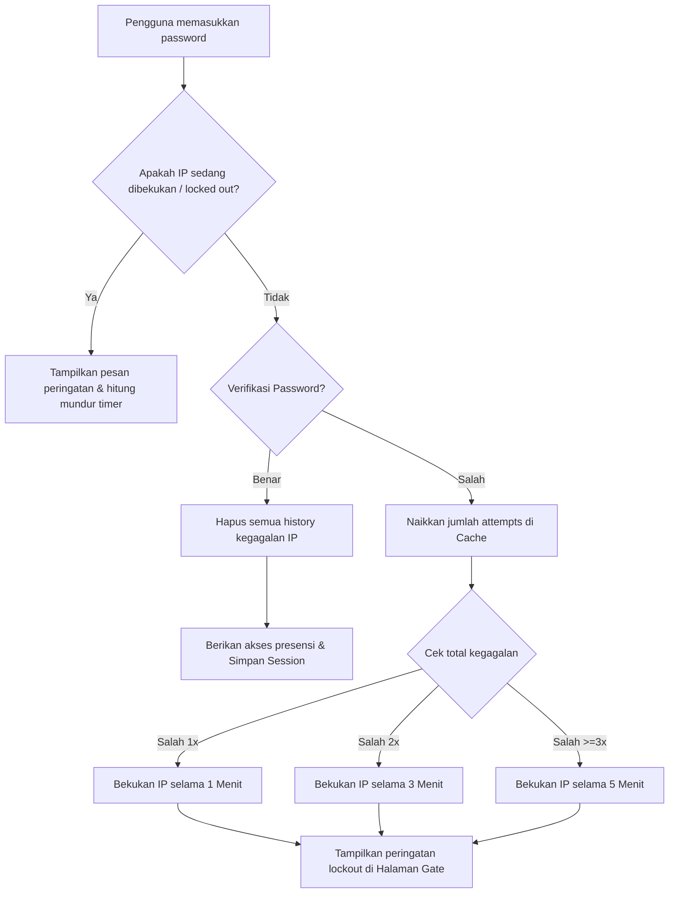

# Panduan Rate Limiting - Password Kegiatan Privat (E-Presensi)

Dokumen ini menjelaskan cara kerja fitur pembatasan percobaan login (**Rate Limiting**) pada halaman kegiatan/event privat yang dilindungi kata sandi (password). Fitur ini bertujuan untuk mencegah serangan *brute-force* (penebakan kata sandi secara berulang) demi keamanan data presensi.

---

## 📌 Alur Kerja Utama (Workflow)

Secara umum, sistem pelindung (*gate*) ini membatasi pengguna yang salah memasukkan kata sandi secara bertahap menggunakan kombinasi **Laravel RateLimiter** dan **Cache Driver**.

Berikut adalah diagram alur logikanya:



---

## 1. Analisis Sisi Backend (Server-Side)

Logika utama pembatasan ini berada di dalam file controller:
📄 [PresenceController.php](file:///c:/laragon/www/git/PKL_UINMALANG/app/Http/Controllers/PresenceController.php#L77-L148) pada method `checkGatePassword`.

### A. Kunci Identifikasi (Unique Keys)
Sistem membedakan batasan tiap pengguna berdasarkan kombinasi ID Event dan alamat IP mereka menggunakan dua kunci:
```php
$throttleKey = 'gate_pass|' . $event->id . '|' . $request->ip();
$attemptsKey = 'gate_pass_attempts|' . $event->id . '|' . $request->ip();
```
*   `$throttleKey`: Digunakan oleh Laravel `RateLimiter` untuk menandai apakah IP pengguna saat ini sedang dalam masa hukuman/pembekuan (*lockout*).
*   `$attemptsKey`: Disimpan di dalam `Cache` (dengan masa kedaluwarsa 60 menit) untuk menghitung akumulasi berapa kali pengguna memasukkan kata sandi yang salah secara berturut-turut.

---

### B. Deteksi Status Lockout
Sebelum memeriksa kata sandi, sistem memeriksa apakah kunci IP tersebut masih dibekukan:
```php
if (RateLimiter::tooManyAttempts($throttleKey, 1)) {
    $seconds = RateLimiter::availableIn($throttleKey);
    $minutes = ceil($seconds / 60);
    return back()->with('warning', "Kata sandi yang Anda masukkan salah. Akses Anda dibekukan sementara. Silakan coba lagi dalam {$minutes} menit.")
                 ->with('lockout_seconds', $seconds);
}
```
Jika `tooManyAttempts()` bernilai `true` (artinya limit sudah melebihi 1 kali batas toleransi), sistem akan langsung menolak proses login dan mengembalikan pengguna ke halaman sebelumnya dengan data waktu tunggu (`lockout_seconds`).

---

### C. Reset Batasan Jika Berhasil
Jika kata sandi yang dimasukkan **cocok/benar**, sistem akan menghapus seluruh catatan kegagalan IP tersebut agar bersih kembali:
```php
if ($isMatch) {
    RateLimiter::clear($throttleKey);
    Cache::forget($attemptsKey);
    session(["event_gate_passed_{$event->id}" => true]);
    return redirect()->route('presence.form', $event->uuid)->with('success', 'Akses diberikan!');
}
```
*   `RateLimiter::clear($throttleKey)`: Menghapus status hukuman IP.
*   `Cache::forget($attemptsKey)`: Mereset ulang counter percobaan salah kembali ke `0`.
*   `session(...)`: Menyimpan status kelulusan gate agar pengguna tidak perlu mengisi password berulang kali selama sesi aktif.

---

### D. Penalti Bertahap (Incremental Decay Time)
Jika kata sandi **salah**, sistem akan menambah jumlah kegagalan dan menetapkan durasi pembekuan yang semakin meningkat berdasarkan akumulasi kesalahan:
```php
// Tambahkan 1 ke counter kesalahan di cache (berlaku selama 60 menit)
$attempts = Cache::get($attemptsKey, 0) + 1;
Cache::put($attemptsKey, $attempts, now()->addMinutes(60));

// Tentukan durasi pembekuan berdasarkan tingkat kesalahan:
if ($attempts === 1) {
    $decaySeconds = 60;   // Percobaan salah ke-1: Dibekukan selama 1 menit (60 detik)
} elseif ($attempts === 2) {
    $decaySeconds = 180;  // Percobaan salah ke-2: Dibekukan selama 3 menit (180 detik)
} else {
    $decaySeconds = 300;  // Percobaan salah ke-3 atau lebih: Dibekukan selama 5 menit (300 detik)
}

// Daftarkan pembekuan IP ke RateLimiter
RateLimiter::hit($throttleKey, $decaySeconds);
```
Dengan skema ini, penebak kata sandi otomatis akan mengalami pelambatan akses yang semakin parah setiap kali mereka menebak dengan salah.

---

## 2. Analisis Sisi Frontend (Client-Side)

Logika visual pembatasan ini berada di dalam file blade:
📄 [gate.blade.php](file:///c:/laragon/www/git/PKL_UINMALANG/resources/views/presence/gate.blade.php#L178-L220).

### A. Tampilan Peringatan & Timer
Jika terdapat sesi pembekuan aktif (`lockout_seconds`), sistem frontend akan memunculkan box info penghitung mundur dan mematikan input form:

```html
@if(session('lockout_seconds'))
  <div class="mt-2 mb-3 py-2 px-3 ...">
    <i class="fas fa-clock text-warning text-sm"></i>
    <span class="text-xs text-muted font-weight-bold">Coba lagi dalam:</span>
    <span class="font-weight-bolder text-dark text-sm mb-0" id="lockout-timer">--:--</span>
  </div>
  ...
@endif
```

---

### B. Script JavaScript Timer
JavaScript di halaman ini bertugas melakukan hitung mundur setiap detik secara *real-time*:

1.  **Mendapatkan Detik Tersisa**: Mengambil sisa waktu pembekuan dari Session Laravel:
    ```javascript
    let secondsLeft = parseInt("{{ session('lockout_seconds') }}") || 180;
    ```
2.  **Menonaktifkan Input & Tombol**: Form input password dan tombol submit dinonaktifkan agar tidak bisa dikirimkan:
    ```javascript
    if (submitBtn) submitBtn.disabled = true;
    if (passwordInput) passwordInput.disabled = true;
    ```
3.  **Interval Hitung Mundur**:
    Setiap detik (`1000ms`), nilai `secondsLeft` akan dikurangi `1` dan diubah formatnya menjadi `MM:SS` (contoh: `04:59`).
4.  **Auto Reload Setelah Selesai**:
    Ketika detik mencapai `<= 0`, form input dan tombol submit akan diaktifkan kembali secara otomatis, lalu halaman di-refresh (`window.location.reload()`) agar siap menerima input sandi baru yang benar:
    ```javascript
    if (secondsLeft <= 0) {
      timerElement.innerText = "00:00";
      if (submitBtn) submitBtn.disabled = false;
      if (passwordInput) passwordInput.disabled = false;
      window.location.reload();
      return;
    }
    ```

---

## 💡 Ringkasan Parameter Teknis

| Nama Kunci Cache | Tipe Penyimpanan | Masa Berlaku / Kedaluwarsa | Fungsi |
| :--- | :--- | :--- | :--- |
| `gate_pass\|{event_id}\|{ip}` | Laravel RateLimiter | Dinamis (60s, 180s, atau 300s) | Menentukan apakah IP dalam hukuman *lockout*. |
| `gate_pass_attempts\|{event_id}\|{ip}` | Cache Key | 60 Menit (sejak kegagalan terakhir) | Menghitung akumulasi kesalahan input sandi. |
| `event_gate_passed_{event_id}` | Session User | Sesuai sesi browser | Menyimpan tanda jika pengguna telah lolos verifikasi. |
