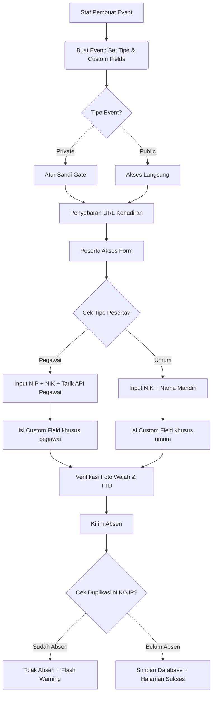
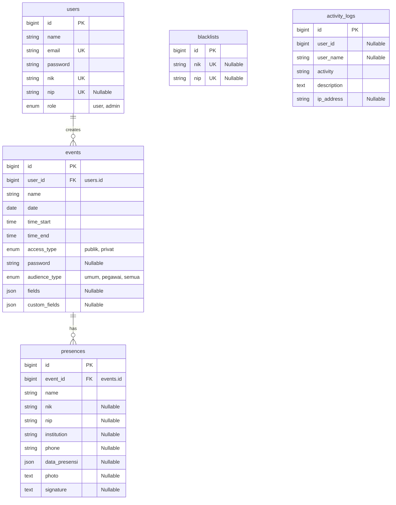

# Draft Laporan PKL Lengkap: Sistem E-Presensi Diskominfo Kota Malang

Draf ini merupakan versi lengkap yang telah disempurnakan. Anda dapat langsung menyalin isi dokumen ini ke berkas laporan Anda. Bab III dan Bab IV telah dirancang mendetail dengan menyertakan alur sistem, rancangan database, cuplikan kode penting, serta penjelasannya untuk kebutuhan presentasi dan ulasan dengan Pembimbing Lapangan.

---

## BAB I: PENDAHULUAN

### 1.1 Latar Belakang
Dinas Komunikasi dan Informatika (Diskominfo) Kota Malang merupakan instansi pemerintahan yang sering menyelenggarakan berbagai kegiatan resmi, seperti rapat koordinasi, pelatihan, sosialisasi, dan forum diskusi. Setiap event tersebut memerlukan pencatatan kehadiran (presensi) peserta yang akurat guna kebutuhan pertanggungjawaban administratif dan evaluasi kegiatan.

Namun, pencatatan kehadiran saat ini masih menghadapi beberapa kendala:
1. **Ketidakpraktisan Presensi Manual**: Penggunaan kertas absensi fisik memakan waktu, rentan robek/hilang, dan menyulitkan proses rekapitulasi data.
2. **Ketiadaan Verifikasi Valid**: Absensi manual tidak memiliki bukti fisik kehadiran yang kuat, sehingga rawan terjadi penitipan absen.
3. **Keterbatasan Kategori Peserta**: Kegiatan sering kali dihadiri secara gabungan oleh Pegawai Pemerintah (ASN/Non-ASN) dan Masyarakat Umum. Presensi konvensional sulit mengintegrasikan verifikasi identitas (seperti NIP pegawai) secara dinamis.
4. **Kebutuhan Custom Field**: Kebutuhan data peserta berbeda-beda untuk setiap event (misalnya, event A memerlukan data "Golongan", sedangkan event B memerlukan data "Alamat").

Berdasarkan permasalahan tersebut, dikembangkan sistem **E-Presensi Diskominfo**. Sistem ini berbasis web mandiri (*self-service*) yang memungkinkan panitia membuat kegiatan secara fleksibel dengan kolom data (*custom fields*) dinamis, verifikasi presensi berbasis capture foto wajah (*webcam*) dan tanda tangan digital (*signature canvas*), serta proteksi kehadiran ganda demi keandalan data.

### 1.2 Rumusan Masalah
1. Bagaimana merancang sistem presensi berbasis event yang dapat menyesuaikan kebutuhan kolom data peserta secara dinamis per kegiatan?
2. Bagaimana mengimplementasikan sistem verifikasi kehadiran mandiri menggunakan capture foto wajah dan tanda tangan digital langsung pada web browser?
3. Bagaimana mencegah terjadinya absensi ganda (duplikasi data) dan penyalahgunaan identitas pada sistem presensi?

### 1.3 Batasan Masalah
1. Sistem dikembangkan berbasis web menggunakan framework Laravel 11.
2. Integrasi data identitas pegawai ASN/Non-ASN menggunakan simulasi API (*mock API*) internal Pemerintah Kota Malang.
3. Verifikasi wajah mengandalkan tangkapan kamera (*webcam*) lokal pada perangkat pengakses dan disimpan dalam format enkripsi Base64 di database.
4. Lokasi presensi tidak dibatasi oleh geofencing GPS (fokus pada kemudahan akses peserta).

### 1.4 Tujuan
1. Membangun aplikasi portal presensi mandiri berbasis event yang memudahkan staf Diskominfo mengelola kehadiran peserta secara digital.
2. Menyediakan fitur *custom fields* dinamis dan integrasi NIP pegawai demi keakuratan data profil peserta.
3. Mencegah kebocoran data presensi ganda melalui verifikasi NIK/NIP dan validasi blacklist.

### 1.5 Manfaat
* **Bagi Instansi (Diskominfo)**: Mempercepat proses rekap absensi, menghemat penggunaan kertas (*paperless*), dan menyediakan laporan kehadiran dalam format Excel yang siap pakai.
* **Bagi Peserta**: Memberikan pengalaman pengisian absensi yang cepat, modern, dan aman.

---

## BAB II: GAMBARAN UMUM INSTANSI

### 2.1 Profil Diskominfo Kota Malang
Dinas Komunikasi dan Informatika Kota Malang beralamat di Jl. Terusan Candi Mendut No.17, Mojolangu, Kec. Lowokwaru, Kota Malang. Instansi ini bertanggung jawab menyelenggarakan urusan pemerintahan di bidang komunikasi, informatika, statistik, dan persandian untuk wilayah Pemerintah Kota Malang.

### 2.2 Visi & Misi Instansi
* **Visi**: Mewujudkan Kota Malang yang Bermartabat melalui transformasi digital pelayanan publik yang transparan dan akuntabel.
* **Misi**:
  1. Meningkatkan infrastruktur teknologi informasi dan komunikasi yang terintegrasi.
  2. Mendorong smart city melalui optimalisasi layanan e-government.
  3. Meningkatkan literasi digital dan keterbukaan informasi publik.

---

## BAB III: ANALISIS DAN PERANCANGAN SISTEM

Dalam bab ini dibahas tahap analisis sistem berjalan, analisis kebutuhan fungsional dan non-fungsional, perancangan arsitektur sistem, serta desain skema database relasional.

### 3.1 Deskripsi Alur Kerja Sistem (System Workflow)
Sistem E-Presensi terbagi menjadi dua bagian utama: **sisi administrator (staf/admin)** untuk manajemen event dan data, serta **sisi peserta** untuk pengisian absensi.



---

### 3.2 Analisis Kebutuhan Sistem

#### 3.2.1 Kebutuhan Fungsional (Functional Requirements)
1. **Otentikasi & Keamanan Pengguna**:
   * Sistem menyediakan modul Login & Register staf pembuat event dengan toggle *eye icon* (buka/tutup kata sandi) guna meningkatkan aspek kepraktisan input (*user experience*).
2. **Manajemen Pembuatan Event Dinamis**:
   * Staf/Admin dapat mengonfigurasi field apa saja yang wajib diisi peserta (No WhatsApp, Jenis Kelamin, Instansi, Alamat, Foto Wajah, Tanda Tangan).
   * Staf/Admin dapat menambahkan kolom kustom bebas (*custom fields*) bertipe text, number, date, atau email, serta menghapus baris isian tersebut jika terjadi kesalahan input di dashboard menggunakan tombol hapus instan.
3. **Logika Kondisional Validasi Dua Arah**:
   * Sistem mendeteksi otomatis penanda target peserta pada label custom field: `(khusus pegawai)` atau `(khusus tamu/masyarakat/umum)`.
   * Di sisi front-end, form akan menyembunyikan inputan yang tidak relevan secara dinamis.
   * Di sisi back-end, validasi akan melonggarkan field tersebut menjadi `nullable` agar tidak terjadi *error validation* bagi kategori peserta yang tidak ditargetkan.
4. **Pencegahan Duplikasi Presensi**:
   * Sistem mendeteksi NIK (atau gabungan NIP bagi pegawai) peserta untuk mencegah satu peserta melakukan pengisian presensi berkali-kali pada kegiatan yang sama.
5. **Rekapitulasi Kehadiran Dinamis**:
   * Menampilkan data kehadiran peserta di tabel dashboard. Kolom tabel menyesuaikan dengan konfigurasi event saat dibuat.
   * Menyediakan fitur ekspor data kehadiran ke MS Excel secara dinamis dan sinkron.

#### 3.2.2 Kebutuhan Non-Fungsional (Non-Functional Requirements)
1. **Perangkat Input Verifikasi**:
   * Kamera web (*webcam*) terintegrasi HTML5 API untuk capture wajah peserta.
   * Papan kanvas grafis berbasis HTML5 Canvas untuk penandatanganan digital.
2. **Kemandirian Jaringan (Offline-Ready Assets)**:
   * Menggunakan ikon lokal (Nucleo Icons bawaan tema Argon 2 & Inline SVG) agar sistem tetap berjalan optimal meskipun server berada dalam jaringan intranet tertutup (tanpa koneksi internet publik).

---

### 3.3 Perancangan Database (ERD & Kamus Data)
Database dirancang menggunakan MySQL/MariaDB dengan struktur relasi sebagai berikut:



* **Relasi Users ke Events**: Setiap akun staf (`users`) berhak memiliki dan mengelola banyak kegiatan (`events`) dengan relasi `One-to-Many` (`1:N`).
* **Relasi Events ke Presences**: Setiap satu kegiatan (`events`) menampung banyak data riwayat kehadiran peserta (`presences`) dengan relasi `One-to-Many` (`1:N`).

---

## BAB IV: IMPLEMENTASI DAN PENGUJIAN SISTEM

Bab ini menjabarkan implementasi kode-kode utama dari logika sistem, antarmuka halaman, serta pengujian fungsionalitas sistem.

### 4.1 Implementasi Kode Logika Utama

#### 4.1.1 Logika Backend Validasi Kondisional & Pencegahan Duplikasi
Berikut adalah implementasi fungsi `submitForm` pada `PresenceController.php` untuk memvalidasi kolom kustom secara kondisional dan mengecek duplikasi kehadiran NIK/NIP:

```php
// app/Http/Controllers/PresenceController.php
public function submitForm(Request $request, $event_id)
{
    $event = Event::findOrFail($event_id);
    $fields = $event->fields ?? [];

    // Aturan validasi dasar
    $rules = [
        'name' => 'required|string',
        'nik' => 'required|size:16',
        'tipe_peserta' => 'required|in:pegawai,umum',
        'phone' => in_array('sc-phone', $fields) ? 'required|string|max:30' : 'nullable|string|max:30',
        'institution' => in_array('sc-institution', $fields) ? 'required|string|max:255' : 'nullable|string|max:255',
        'photo' => in_array('sc-photo', $fields) ? 'required|string' : 'nullable|string',
        'signature' => in_array('sc-signature', $fields) ? 'required|string' : 'nullable|string',
    ];

    // NIP wajib diisi jika tipe peserta adalah pegawai
    $rules['nip'] = ($request->tipe_peserta === 'pegawai') ? 'required|size:18' : 'nullable|size:18';

    // Validasi Custom Fields secara dinamis
    if ($event->custom_fields) {
        foreach ($event->custom_fields as $cf) {
            $slug = Str::slug($cf['label'], '_');
            $isKhususPegawai = (stripos($cf['label'], 'khusus pegawai') !== false);
            $isKhususTamu = (stripos($cf['label'], 'khusus tamu') !== false || 
                             stripos($cf['label'], 'khusus masyarakat') !== false || 
                             stripos($cf['label'], 'khusus umum') !== false);
            
            if ($event->audience_type === 'semua') {
                // Jika event untuk semua, longgarkan validasi bagi yang tidak relevan
                if ($isKhususPegawai && $request->input('tipe_peserta') === 'umum') {
                    $rules[$slug] = 'nullable';
                } elseif ($isKhususTamu && $request->input('tipe_peserta') === 'pegawai') {
                    $rules[$slug] = 'nullable';
                } else {
                    $rules[$slug] = 'required';
                }
            } else {
                $rules[$slug] = 'required';
            }
        }
    }

    $request->validate($rules);

    // LOGIKA PENCEGAHAN DUPLIKASI PRESENSI
    $isAlreadyPresence = Presence::where('event_id', $event->id)
        ->where(function ($q) use ($request) {
            $q->where('nik', $request->nik);
            if ($request->filled('nip') && $request->tipe_peserta === 'pegawai') {
                $q->orWhere('nip', $request->nip);
            }
        })->exists();

    if ($isAlreadyPresence) {
        return back()->withInput()->with('warning', 'Anda sudah melakukan presensi pada event ini!');
    }

    // Proses simpan data presensi...
}
```

---

#### 4.1.2 Logika Frontend Dynamic Form Toggle
Untuk menyesuaikan inputan formulir secara instan di sisi browser tanpa memuat ulang halaman:

```javascript
// resources/views/presence/form.blade.php
function toggleParticipantType() {
    const tipePesertaSelect = document.getElementById('tipe_peserta');
    if (!tipePesertaSelect) return;
    
    const tipePeserta = tipePesertaSelect.value;
    const nipWrapper = document.getElementById('nip-card-wrapper');
    const nipInput = document.getElementById('form-nip-field');

    if (tipePeserta === 'pegawai') {
        nipWrapper.style.display = 'block';
        if (nipInput) nipInput.setAttribute('required', 'required');
        
        // Sembunyikan custom field khusus tamu, tampilkan khusus pegawai
        document.querySelectorAll('[data-khusus-tamu="true"]').forEach(el => {
            el.style.display = 'none';
            el.querySelectorAll('input, select, textarea').forEach(i => i.removeAttribute('required'));
        });
        document.querySelectorAll('[data-khusus-pegawai="true"]').forEach(el => {
            el.style.display = 'block';
            el.querySelectorAll('input, select, textarea').forEach(i => i.setAttribute('required', 'required'));
        });
    } else {
        nipWrapper.style.display = 'none';
        if (nipInput) {
            nipInput.removeAttribute('required');
            nipInput.value = '';
        }

        // Sembunyikan custom field khusus pegawai, tampilkan khusus tamu
        document.querySelectorAll('[data-khusus-pegawai="true"]').forEach(el => {
            el.style.display = 'none';
            el.querySelectorAll('input, select, textarea').forEach(i => i.removeAttribute('required'));
        });
        document.querySelectorAll('[data-khusus-tamu="true"]').forEach(el => {
            el.style.display = 'block';
            el.querySelectorAll('input, select, textarea').forEach(i => i.setAttribute('required', 'required'));
        });
    }
}
```

---

#### 4.1.3 Antarmuka Dynamic Table Columns & Excel
Membangun tabel rekapitulasi data kehadiran yang membaca field dinamis per kegiatan:

```html
<!-- resources/views/dashboard/presences.blade.php -->
<thead>
  <tr>
    <th>No</th>
    <th>NIK</th>
    @if($event->audience_type === 'pegawai' || $event->audience_type === 'semua')
      <th>NIP</th>
    @endif
    <th>Nama Lengkap</th>
    @if(in_array('sc-phone', $event->fields ?? []))
      <th>No WhatsApp</th>
    @endif
    @if(in_array('sc-gender', $event->fields ?? []))
      <th>Jenis Kelamin</th>
    @endif
    <!-- Perulangan untuk Header Custom Fields -->
    @if($event->custom_fields)
      @foreach($event->custom_fields as $cf)
        <th>{{ $cf['label'] }}</th>
      @endforeach
    @endif
  </tr>
</thead>
```

---

### 4.2 Pengujian Sistem (System Testing)

Pengujian dilakukan menggunakan metode **Black Box Testing** untuk menguji fungsionalitas input dan output antarmuka pengguna:

| No | Fitur yang Diuji | Skenario Pengujian | Hasil yang Diharapkan | Status |
|----|------------------|--------------------|-----------------------|--------|
| 1  | Login Pengguna | Menginput password dengan klik toggle *eye icon*. | Password terlihat/tersembunyi secara instan tanpa bug ikon hilang. | Sukses |
| 2  | Custom Field CRUD | Membuat event baru, menambah 3 custom field, lalu menghapus 1 baris menggunakan tombol hapus. | Baris custom field terhapus dari dokumen HTML secara instan tanpa me-refresh halaman. | Sukses |
| 3  | Validasi Kondisional | Memilih kategori "Masyarakat Umum" pada event gabungan (*semua*). | Kolom kustom berlabel `(khusus pegawai)` disembunyikan dan diabaikan saat validasi backend. | Sukses |
| 4  | Cek Duplikasi | Peserta dengan NIK yang sama melakukan absen ulang pada event yang sama. | Pengiriman ditolak, sistem melakukan redirect back dan menampilkan notifikasi: *"Anda sudah melakukan presensi pada event ini!"*. | Sukses |
| 5  | Rekap & Ekspor Excel | Melakukan ekspor data presensi ke MS Excel. | Struktur kolom Excel sesuai persis dengan kolom dinamis yang aktif pada tabel rekap web. | Sukses |
