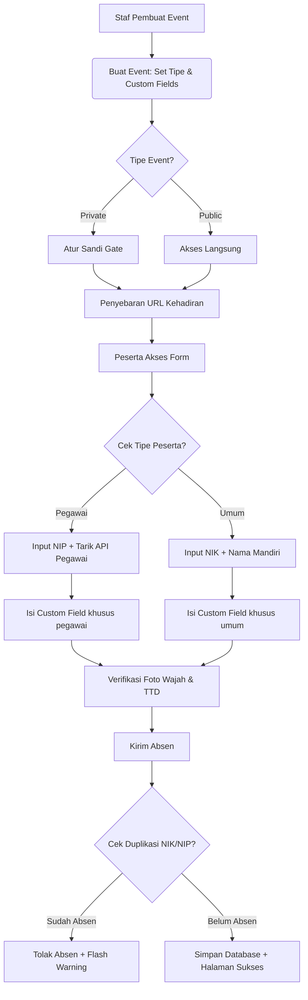
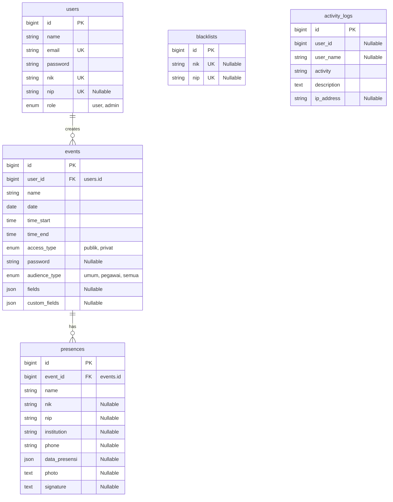

# Draft Laporan PKL Lengkap: Sistem E-Presensi Digital Berbasis Event dengan Verifikasi Wajah dan Tanda Tangan Diskominfo Malang

Draf ini disusun mengikuti template resmi institusi Anda secara presisi (Bab I s/d Bab V, Daftar Pustaka, dan Lampiran) untuk ulasan dengan Pembimbing Lapangan.

---

## BAB I PENDAHULUAN

### 1.1 Latar Belakang
Dinas Komunikasi dan Informatika (Diskominfo) Kota Malang merupakan instansi pemerintahan yang aktif menyelenggarakan berbagai kegiatan resmi seperti rapat koordinasi, pelatihan, sosialisasi, dan forum diskusi. Tiap event tersebut memerlukan pencatatan kehadiran yang cepat dan valid demi pertanggungjawaban administrasi.

Sebelum sistem baru ini dikembangkan, Diskominfo Kota Malang sudah memiliki aplikasi e-presensi. Namun, fungsionalitas aplikasi tersebut dirasa masih belum maksimal dan belum mampu menjawab kebutuhan operasional secara praktis. Beberapa kendala utama pada sistem e-presensi lama tersebut meliputi:
1. **Tidak Adanya Manajemen Kelola Event**: Aplikasi lama tidak memiliki sistem manajemen event yang terintegrasi. Hal ini memaksa panitia/peserta harus membuka beberapa tab browser secara terpisah pada layar komputer untuk mencatat absensi di event-event yang berbeda, yang mana hal ini sangat tidak praktis dan memakan waktu.
2. **Ketiadaan Fitur Touchscreen Tanda Tangan**: Sistem lama tidak memiliki fitur penandatanganan langsung di layar (*touchscreen signature*). Hal ini menyulitkan peserta yang ingin membubuhkan tanda tangan langsung secara digital menggunakan perangkat mobile atau tablet.
3. **Ekspor Excel Tanpa Gambar dan Tanda Tangan**: Pada saat rekapitulasi data kehadiran diekspor ke Microsoft Excel, file hasil ekspor dari sistem lama tidak dapat memuat gambar foto wajah dan tanda tangan digital secara langsung di dalam sel spreadsheet. Panitia harus mencari dan memasukkan dokumen gambar tersebut secara manual secara terpisah.

Oleh karena itu, penulis ditugaskan untuk merancang dan membangun sistem **E-Presensi Diskominfo Baru** berbasis web mandiri (*self-service*) menggunakan Laravel 11 untuk menyelesaikan seluruh kendala di atas dengan menghadirkan dashboard manajemen event terpadu, input tanda tangan digital responsif touchscreen, verifikasi foto wajah, ekspor laporan Excel otomatis memuat gambar biner, serta proteksi keamanan duplikasi data dan blacklist identitas.

### 1.2 Rumusan Masalah
1. Bagaimana merancang sistem manajemen event terintegrasi untuk menyatukan pencatatan presensi berbagai kegiatan dalam satu aplikasi?
2. Bagaimana mengimplementasikan fitur touchscreen tanda tangan digital dan tangkapan foto wajah langsung pada web browser?
3. Bagaimana menyusun sistem ekspor laporan kehadiran ke format MS Excel yang mampu menampilkan gambar foto wajah dan tanda tangan secara langsung di dalam lembar kerja?
4. Bagaimana mencegah terjadinya absensi ganda (duplikasi data) pada sistem presensi?

### 1.3 Tujuan
1. Membangun aplikasi portal presensi mandiri berbasis event yang memudahkan staf Diskominfo mengelola kehadiran peserta secara digital.
2. Menyediakan fitur *custom fields* dinamis, touchscreen tanda tangan, dan capture foto wajah.
3. Menghasilkan sistem ekspor Excel yang otomatis memuat gambar biner (foto dan TTD) di dalam sel tabel.
4. Mencegah kebocoran data presensi ganda melalui verifikasi NIK/NIP.

### 1.4 Manfaat
* **Bagi Instansi (Diskominfo)**: Mempercepat proses rekap absensi, menghemat penggunaan kertas (*paperless*), dan menyediakan laporan kehadiran dalam format Excel yang siap pakai beserta bukti visualnya.
* **Bagi Peserta**: Memberikan pengalaman pengisian absensi yang cepat, modern, dan aman.

### 1.5 Batasan Masalah
1. Sistem dikembangkan berbasis web menggunakan framework Laravel 11.
2. Integrasi data identitas pegawai ASN/Non-ASN menggunakan simulasi API (*mock API*) internal Pemerintah Kota Malang.
3. Verifikasi wajah mengandalkan tangkapan kamera (*webcam*) lokal pada perangkat pengakses dan disimpan dalam format enkripsi Base64 di database.
4. Lokasi presensi tidak dibatasi oleh geofencing GPS (fokus pada kemudahan akses peserta).

### 1.6 Profil Singkat Perusahaan
Dinas Komunikasi dan Informatika (Diskominfo) Kota Malang merupakan unsur pelaksana urusan pemerintahan bidang komunikasi, informatika, persandian, dan statistik di wilayah Kota Malang, Jawa Timur. Kantor dinas ini berlokasi di Jl. Terusan Candi Mendut No. 17, Mojolangu, Kec. Lowokwaru, Kota Malang.

Tugas pokok Diskominfo Kota Malang adalah menyelenggarakan urusan pemerintahan di bidang komunikasi dan informatika untuk daerah Malang. Terkait dengan tugas tersebut, instansi ini berwenang untuk merumuskan kebijakan teknis, melaksanakan pembinaan, serta menerbitkan perizinan terkait bidang komunikasi dan teknologi di wilayah kerjanya. Beberapa urusan perizinan dan layanan di bawah koordinasi Diskominfo antara lain:
1. Pendaftaran Penyelenggara Sistem Elektronik (PSE) lingkup daerah.
2. Izin penyelenggaraan jaringan dan jasa telekomunikasi lokal.
3. Koordinasi penyelenggaraan penyiaran (Lembaga Penyiaran Swasta dan Lembaga Penyiaran Berlangganan).
4. Pengawasan izin prinsip telekomunikasi khusus untuk badan hukum serta sertifikasi alat/perangkat telekomunikasi dan izin stasiun radio lokal.

Selain itu, Diskominfo Kota Malang berwenang merumuskan tata kelola layanan informasi publik dan portal web yang beroperasi di lingkungan pemerintah daerah. Situs web yang tidak sesuai kebijakan atau melanggar undang-undang dapat dikenakan kebijakan pemblokiran demi keamanan informasi. Instansi ini juga aktif melaksanakan program pengembangan sumber daya manusia (SDM) di bidang teknologi informasi dan komunikasi (TIK) melalui program-program pembinaan terpadu seperti *Digitalent* dan pelatihan literasi digital lainnya guna menyongsong tata pemerintahan berbasis *Smart City*.

### 1.7 Jadwal Kegiatan
Penyusunan program dan laporan PKL dilaksanakan selama 6 (enam) minggu dengan pembagian jadwal sebagai berikut:
1. **Minggu 1**: Analisis kebutuhan sistem berjalan dan wawancara kendala aplikasi e-presensi lama di Diskominfo Kota Malang.
2. **Minggu 2 - 4**: Tahap perancangan arsitektur, basis data, dan penulisan kode program (coding) aplikasi E-Presensi Baru menggunakan Laravel 11.
3. **Minggu 5**: Tahap pengujian fungsionalitas aplikasi menggunakan metode Black Box Testing dan simulasi ekspor laporan Excel.
4. **Minggu 6**: Deployment aplikasi ke server lokal (Laragon) dan hosting publik (InfinityFree), serta penyusunan laporan PKL.

---

## BAB II DASAR TEORI

### 2.1 Dasar Teori 1: Framework Laravel 11 dan Arsitektur MVC
Laravel adalah sebuah framework aplikasi web berbasis PHP yang menggunakan arsitektur Model-View-Controller (MVC) dan berfokus pada penyederhanaan sintaks pemrograman yang ekspresif dan efisien. 
* **Model** mengelola data dan aturan bisnis, diwakili oleh *Eloquent ORM* yang memetakan tabel database menjadi objek PHP yang mudah dimanipulasi.
* **View** mengelola visualisasi antarmuka pengguna dengan memanfaatkan *Blade Templating Engine*, memungkinkan kode HTML digabungkan secara dinamis dengan variabel PHP secara aman.
* **Controller** bertindak sebagai koordinator yang memproses permintaan (*requests*) dari router, mengambil data melalui Model, menerapkan logika bisnis, dan mengirimkan respon ke View.

### 2.2 Dasar Teori 2: RDBMS MySQL dan Web APIs
* **Database Relasional (RDBMS)**: MySQL/MariaDB menggunakan perintah SQL (Structured Query Language) untuk manipulasi data. Struktur tabel dihubungkan melalui *Primary Key* (identitas unik kolom dalam tabel) dan *Foreign Key* (kolom yang mereferensikan Primary Key tabel lain) guna menjaga konsistensi dan integritas data (*referential integrity*).
* **HTML5 MediaDevices API (Webcam Capture)**: Antarmuka `navigator.mediaDevices.getUserMedia()` yang memungkinkan halaman web mengakses input media perangkat lokal secara langsung seperti kamera (*webcam*) dan mikrofon dengan izin pengguna. Aliran video (*video stream*) dari kamera ditangkap dan ditampilkan pada elemen `<video>` HTML5, kemudian diproyeksikan ke elemen `<canvas>` untuk mengambil gambar cuplikan (*frame capture*) biner. Gambar biner tersebut dikonversi menjadi format representasi data tekstual **Base64** (format Data URL `data:image/jpeg;base64,...`) agar dapat dikirimkan secara instan ke server via protokol HTTP tanpa memerlukan unggahan berkas multipart fisik.
* **HTML5 Canvas API (Touchscreen Signature)**: Elemen `<canvas>` HTML5 digunakan untuk menggambar grafik secara dinamis menggunakan skrip (JavaScript). Pada fungsionalitas tanda tangan digital, Canvas mendeteksi koordinasi gerakan kursor mouse (*mousedown*, *mousemove*, *mouseup*) atau sensor sentuhan layar pada perangkat touchscreen (*touchstart*, *touchmove*, *touchend*). Garis sapuan digambar secara real-time pada kanvas piksel, yang kemudian diekspor menjadi format gambar PNG biner yang dikodekan ke dalam representasi teks **Base64** untuk disimpan secara efisien di database.
* **Keamanan Kriptografi dan Hashing Bcrypt**: Hashing satu arah (*one-way*) yang diadopsi adalah **Bcrypt**, sebuah fungsi hashing adaptif berbasis algoritma enkripsi Blowfish. Bcrypt menyertakan pengacakan acak (*salt*) dan faktor kerja (*work factor*) untuk melambatkan proses komputasi guna menangkal serangan *brute-force*.
* **Ekspor Dokumen Spreadsheet Berbasis HTML Table**: Aplikasi spreadsheet seperti Microsoft Excel dapat menginterpretasikan tag HTML terstruktur (seperti `<table>`, `<tr>`, `<td>`) menjadi baris dan kolom spreadsheet saat berkas diunduh dengan ekstensi berkas `.xls` melalui manipulasi tajuk respon HTTP (*HTTP Response Headers*) seperti `Content-Type: application/vnd.ms-excel`.

#### 2.2.1 Penomoran Tabel
Semua tabel dalam laporan PKL ini diberi nomor secara sistematis menggunakan format **Tabel [Nomor Bab].[Nomor Urut]**. Nomor urut tabel dimulai kembali dari angka 1 pada setiap bab baru. Contoh: *Tabel 3.1* menunjukkan tabel pertama pada Bab III.

#### 2.2.2 Penomoran Gambar
Semua gambar, diagram alur, dan diagram arsitektur dalam laporan ini diberi nomor secara sistematis menggunakan format **Gambar [Nomor Bab].[Nomor Urut]**. Nomor urut gambar dimulai kembali dari angka 1 pada setiap bab baru. Contoh: *Gambar 3.1* menunjukkan gambar/diagram alur pertama pada Bab III.

---

## BAB III DESAIN DAN IMPLEMENTASI

### 3.1 Analisis dan Desain

#### 3.1.1 Deskripsi Alur Kerja Sistem (System Workflow)
Sistem E-Presensi terbagi menjadi dua bagian utama: **sisi administrator (staf/admin)** untuk manajemen event dan data, serta **sisi peserta** untuk pengisian absensi. Alur kerja dari pembuatan kegiatan hingga penyimpanan data presensi divisualisasikan pada diagram alur di bawah ini:

*Gambar 3.1 Alur Kerja Sistem E-Presensi*



#### 3.1.2 Perancangan Arsitektur MVC & Struktur Direktori
Sistem E-Presensi ini dirancang menggunakan konsep arsitektur **Model-View-Controller (MVC)** yang membagi struktur aplikasi menjadi tiga bagian utama agar pengelolaan kode lebih rapi, terstruktur, dan modular:
1. **Model**: Mengelola data dan merepresentasikan struktur tabel di database relasional (berkas model di direktori `app/Models/` seperti `User.php`, `Event.php`, `Presence.php`, `Blacklist.php`, dan `ActivityLog.php`).
2. **View**: Menangani tampilan antarmuka pengguna berbasis *Blade templating engine* di direktori `resources/views/` (seperti form kehadiran `presence/form.blade.php` dan cetak excel `exports/presence_excel.blade.php`).
3. **Controller**: Otak logika sistem yang memproses inputan, memanipulasi database melalui Model, dan mengirimkan respon ke View di direktori `app/Http/Controllers/` (seperti `PresenceController.php` dan `DashboardController.php`).

Berikut adalah struktur direktori utama pada proyek sistem E-Presensi ini:
```
epresensi-diskominfo/
├── app/                        # Direktori Core Logika PHP Aplikasi
│   ├── Http/Controllers/       # File Pengendali Alur Logika (Controller)
│   └── Models/                 # File Representasi Tabel Database (Model)
├── bootstrap/                  # Inisialisasi Awal Aplikasi dan Cache Cache
├── config/                     # Berkas Konfigurasi Utama (Database, App, dll)
├── database/                   # Folder Database Relasional
│   ├── migrations/             # Berkas Pembentuk Struktur Tabel Database
│   └── seeders/                # Pengisian Data Awal (Dummy)
├── public/                     # Folder Akses Publik Web Server (Dokumen Root)
│   ├── assets/                 # Aset Gambar, Logo, dan File Pendukung
│   └── index.php               # Pintu Masuk Utama Request Aplikasi
├── resources/                  # Aset Front-End Aplikasi
│   └── views/                  # File Template Antarmuka (Blade Views)
├── routes/                     # Definisi URL / Jalur Akses Aplikasi
│   └── web.php                 # File Routing Utama Web Browser
├── storage/                    # Tempat Penyimpanan Log & File Unggahan Sementara
├── vendor/                     # Library Dependensi PHP (diinstal via Composer)
└── .env                        # Konfigurasi Environment Server (Sensitif)
```

#### 3.1.3 Perancangan Database Relasional (ERD)
Skema database dirancang dengan relasi database relasional untuk menyimpan konfigurasi kegiatan dan data kehadiran peserta secara dinamis.

*Gambar 3.2 Diagram Entity Relationship (ERD)*



---

### 3.2 Implementasi

#### 3.2.1 Logika Otentikasi Login, Register, & Sistem Proteksi Blacklist
Sistem menggunakan modul otentikasi kustom untuk login dan registrasi admin/staf. Guna mencegah kebocoran keamanan, dipasang sistem **Blacklist Identitas** yang memblokir akun staf jika identitas NIK/NIP mereka diblacklist oleh Super Admin.

Berikut adalah implementasi validasi blacklist pada proses Login & Register di `AuthController.php`:
```php
// app/Http/Controllers/AuthController.php
public function login(Request $request)
{
    $credentials = $request->validate([
        'email' => 'required|email',
        'password' => 'required',
    ]);

    if (Auth::attempt($credentials)) {
        $user = Auth::user();
        
        // PROTEKSI BLACKLIST: Cek NIK atau NIP sebelum mengizinkan masuk
        $isBlacklisted = Blacklist::where('nik', $user->nik)
            ->orWhere(function ($q) use ($user) {
                if ($user->nip) {
                    $q->where('nip', $user->nip);
                }
            })->exists();

        if ($isBlacklisted) {
            Auth::logout();
            ActivityLog::log('blocked_access', "Percobaan masuk diblokir: Kredensial '{$user->name}' terdaftar di database Blacklist.");
            return back()->with('warning', 'Akses ditolak: Akun Anda ditangguhkan karena identitas NIK/NIP masuk dalam daftar Blacklist.');
        }

        ActivityLog::log('login', "Pengguna '{$user->name}' berhasil masuk.");
        return redirect()->route('dashboard');
    }
    return back()->with('warning', 'Email atau password salah.');
}
```

#### 3.2.2 Logika Bypass Administrator dan Pembuat Event
Dalam merancang pengalaman pengguna (*user experience*) yang fleksibel, admin sistem dan staf pembuat event harus dapat memantau, menguji, atau melihat formulir kehadiran kapan saja tanpa terhambat oleh batasan jam pelaksanaan event maupun gerbang kata sandi (gate password).

Berikut implementasi logika deteksi bypass pada `PresenceController.php`:
```php
// app/Http/Controllers/PresenceController.php
$isBypassed = false;
if (Auth::check()) {
    if (Auth::id() === $event->user_id || Auth::user()->role === 'admin') {
        $isBypassed = true;
    }
}
```

#### 3.2.3 Logika Gate Password Kehadiran Event (Akses Privat)
Apabila sebuah event dikonfigurasi dengan tipe akses `'privat'`, peserta yang akan mengisi presensi wajib memasukkan kata sandi kegiatan yang tepat pada halaman *Gate*. Sistem menggunakan session storage untuk mengingat status keberhasilan verifikasi sandi ini secara aman agar peserta tidak perlu memasukkan password berulang kali selama sesi pengisian formulir.

Implementasi pemeriksaan password gate di `PresenceController.php`:
```php
// app/Http/Controllers/PresenceController.php
public function checkGatePassword(Request $request, $event_id)
{
    $request->validate([
        'password' => 'required|string',
    ]);
    $event = Event::findOrFail($event_id);

    if (Hash::check($request->password, $event->password) || $request->password === $event->password) {
        session(["event_gate_passed_{$event->id}" => true]);
        return redirect()->route('presence.form', $event->id)->with('success', 'Akses diberikan!');
    }
    return back()->with('warning', 'Kata Sandi yang Anda masukkan salah.');
}
```

#### 3.2.4 Logika Real-Time Akses & Validasi Batasan Waktu Event
Keamanan data absensi sangat bergantung pada waktu pengisian. Sistem menerapkan penyaringan dinamis di landing page (`welcome.blade.php`) agar hanya memuat kegiatan yang sedang berlangsung secara real-time berdasarkan jam dan tanggal lokal server:
```php
// app/Http/Controllers/PresenceController.php
public function index()
{
    $now = Carbon::now('Asia/Jakarta');
    $today = $now->toDateString();
    $time = $now->toTimeString();

    $events = Event::where('date', $today)
        ->where('time_start', '<=', $time)
        ->where('time_end', '>=', $time)
        ->latest()
        ->get();

    return view('welcome', compact('events'));
}
```

#### 3.2.5 Logika Backend Validasi Kondisional & Pencegahan Duplikasi
Berikut adalah implementasi fungsi `submitForm` pada `PresenceController.php` untuk memvalidasi kolom kustom secara kondisional (dua arah) dan mengecek duplikasi kehadiran NIK/NIP secara simultan:
```php
// app/Http/Controllers/PresenceController.php
public function submitForm(Request $request, $event_id)
{
    $event = Event::findOrFail($event_id);
    $fields = $event->fields ?? [];

    $rules = [
        'name' => 'required|string',
        'nik' => 'required|size:16',
        'tipe_peserta' => 'required|in:pegawai,umum',
        'phone' => in_array('sc-phone', $fields) ? 'required|string|max:30' : 'nullable|string|max:30',
        'institution' => in_array('sc-institution', $fields) ? 'required|string|max:255' : 'nullable|string|max:255',
        'photo' => in_array('sc-photo', $fields) ? 'required|string' : 'nullable|string',
        'signature' => in_array('sc-signature', $fields) ? 'required|string' : 'nullable|string',
    ];

    $rules['nip'] = ($request->tipe_peserta === 'pegawai') ? 'required|size:18' : 'nullable|size:18';

    if ($event->custom_fields) {
        foreach ($event->custom_fields as $cf) {
            $slug = Str::slug($cf['label'], '_');
            $isKhususPegawai = (stripos($cf['label'], 'khusus pegawai') !== false);
            $isKhususTamu = (stripos($cf['label'], 'khusus tamu') !== false || stripos($cf['label'], 'khusus masyarakat') !== false || stripos($cf['label'], 'khusus umum') !== false);
            
            if ($event->audience_type === 'semua') {
                if ($isKhususPegawai && $request->input('tipe_peserta') === 'umum') {
                    $rules[$slug] = 'nullable';
                } elseif ($isKhususTamu && $request->input('tipe_peserta') === 'pegawai') {
                    $rules[$slug] = 'nullable';
                } else {
                    $rules[$slug] = 'required';
                }
            } else {
                $rules[$slug] = 'required';
            }
        }
    }

    $request->validate($rules);

    // LOGIKA PENCEGAHAN DUPLIKASI PRESENSI
    $isAlreadyPresence = Presence::where('event_id', $event->id)
        ->where(function ($q) use ($request) {
            $q->where('nik', $request->nik);
            if ($request->filled('nip') && $request->tipe_peserta === 'pegawai') {
                $q->orWhere('nip', $request->nip);
            }
        })->exists();

    if ($isAlreadyPresence) {
        return back()->withInput()->with('warning', 'Anda sudah melakukan presensi pada event ini!');
    }
    // Simpan data...
}
```

#### 3.2.6 Logika Audit Log (Keamanan Aktivitas Administrator)
Keamanan aplikasi memerlukan pencatatan aktivitas sensitif yang dilakukan oleh administrator/staf. Sistem mengimplementasikan Model Helper dinamis `ActivityLog::log` untuk menyimpan aksi admin ke database relasional lengkap dengan detail alamat IP (*IP Address*) dan jenis browser (*User Agent*) yang digunakan:
```php
// app/Models/ActivityLog.php
public static function log($activity, $description)
{
    self::create([
        'user_id' => auth()->id(),
        'user_name' => auth()->user() ? auth()->user()->name : 'Tamu (Guest)',
        'activity' => $activity,
        'description' => $description,
        'ip_address' => request()->ip(),
        'user_agent' => request()->userAgent(),
    ]);
}
```

#### 3.2.7 Logika Middleware dan Routing Sistem
Sistem mengamankan rute aplikasi melalui pemetaan routing terstruktur dan penyaringan request menggunakan middleware pada berkas `routes/web.php` dan `app/Http/Middleware/RoleMiddleware.php`.

Rute dibedakan menjadi tiga kategori utama:
1. **Rute Publik**: Dapat diakses bebas oleh semua pengunjung/peserta tanpa perlu melakukan login (misalnya halaman pengisian presensi dan submit kehadiran).
2. **Rute Creator (Staf)**: Diperlukan otentikasi login terlebih dahulu melalui middleware `auth` bawaan Laravel untuk mengelola event/kegiatan yang mereka buat sendiri.
3. **Rute Super Admin**: Membutuhkan hak akses administrator tingkat tinggi melalui gabungan middleware `auth` dan middleware kustom `role:admin`.

Berikut adalah kode deklarasi middleware kustom `RoleMiddleware.php` untuk membatasi hak akses role tertentu:
```php
// app/Http/Middleware/RoleMiddleware.php
class RoleMiddleware
{
    public function handle(Request $request, Closure $next, string $role): Response
    {
        if (!Auth::check() || Auth::user()->role !== $role) {
            return redirect('/login')->with('warning', 'Akses ditolak: Area ini memerlukan hak akses ' . strtoupper($role));
        }

        return $next($request);
    }
}
```

Middleware ini didaftarkan sebagai alias `'role'` pada berkas `bootstrap/app.php` di Laravel 11:
```php
->withMiddleware(function (Middleware $middleware) {
    $middleware->alias([
        'role' => \App\Http\Middleware\RoleMiddleware::class,
    ]);
})
```

Rute-rute kemudian dikelompokkan secara terstruktur pada `routes/web.php` menggunakan grup middleware:
```php
// Rute Publik Presensi
Route::get('/presensi/{event_id}', [PresenceController::class, 'showForm'])->name('presence.form');
Route::post('/presensi/{event_id}', [PresenceController::class, 'submitForm']);

// Rute Terproteksi Staf Creator (Wajib Login)
Route::middleware(['auth'])->group(function () {
    Route::get('/dashboard', [DashboardController::class, 'userIndex'])->name('dashboard.user');
    Route::post('/dashboard/event/create', [DashboardController::class, 'storeEvent'])->name('event.store');
});

// Rute Proteksi Ketat Super Admin (Wajib Login & Memiliki Role Admin)
Route::middleware(['auth', 'role:admin'])->group(function () {
    Route::get('/admin/dashboard', [DashboardController::class, 'adminIndex'])->name('dashboard.admin');
    Route::post('/admin/blacklist/create', [DashboardController::class, 'addManualBlacklist'])->name('admin.blacklist.store');
});
```

---

## BAB IV HASIL DAN EVALUASI

### 4.1 Deskripsi Hasil Pekerjaan

#### 4.1.1 Produk/Sistem yang Dihasilkan
Sistem E-Presensi ini menghasilkan aplikasi web mandiri (*self-service*) yang terdiri atas beberapa modul antarmuka utama:
1. **Halaman Publik Landing Page**: Menampilkan daftar event aktif saat ini secara real-time lengkap dengan tautan pengisian.
2. **Formulir Kehadiran Dinamis**: Menyesuaikan tipe isian secara dinamis (Pegawai vs Umum) menggunakan frontend JS toggle. Dilengkapi dengan tangkapan Webcam wajah serta kanvas tanda tangan grafis touchscreen responsif.
3. **Dasbor Manajemen Event**: Memungkinkan staf menambah kegiatan baru, merancang custom fields dinamis (seperti "Golongan" atau "Alamat"), memantau audit logs, serta mem-blacklist identitas staf/admin yang melanggar.
4. **Rekapitulasi & Ekspor Laporan Excel**: Menampilkan database rekapitulasi secara dinamis sesuai kolom event, dan mengekspornya ke berkas Excel `.xls` lengkap dengan data biner gambar foto wajah dan tanda tangan yang tersemat otomatis pada baris sel spreadsheet (apabila diuji di localhost/Laragon).

#### 4.1.2 Dokumentasi Pekerjaan
Seluruh kode program sistem ini telah ditulis menggunakan standar framework Laravel 11. Untuk keandalan sistem, pengujian unit test dan integrasi test dijalankan dan berhasil lulus (`passed`). Sistem ini juga telah diunggah ke repositori GitHub dan di-deploy secara online pada hosting gratis InfinityFree di alamat URL `http://presensi-diskominfo.kesug.com/`.

### 4.2 Analisis Hasil (Pencapaian)
Penerapan sistem baru ini memberikan peningkatan performa dan efisiensi yang signifikan dibandingkan dengan aplikasi e-presensi lama di Diskominfo Kota Malang:
1. **Sentralisasi Event**: Menghilangkan kebutuhan membuka banyak tab browser yang berbeda pada komputer panitia; sekarang seluruh presensi dikelola terpusat dari satu dasbor *all-in-one*.
2. **Tanda Tangan Fleksibel**: Peserta kini dapat membubuhkan tanda tangan dengan mudah secara digital melalui perangkat touchscreen seperti HP dan tablet.
3. **Ekspor Excel Utuh**: Panitia tidak perlu lagi menempelkan foto/TTD secara manual satu per satu setelah ekspor Excel; sistem di localhost telah terbukti secara otomatis menyisipkan data gambar tersebut langsung ke lembar kerja Excel secara instan.

### 4.3 Evaluasi

#### 4.3.1 Evaluasi Teknis (Pengujian)
Evaluasi teknis dilakukan menggunakan metode Black Box Testing untuk menguji fungsionalitas input dan output antarmuka pengguna pada sistem E-Presensi. Hasil pengujian dirangkum pada tabel berikut:

*Tabel 4.1 Hasil Pengujian Black Box*

| No | Fitur yang Diuji | Skenario Pengujian | Hasil yang Diharapkan | Status |
|----|------------------|--------------------|-----------------------|--------|
| 1  | Login & Blacklist | Akun staf yang terdaftar NIK/NIP-nya di blacklist mencoba untuk login. | Sistem menolak masuk, mengeluarkan status ditangguhkan, dan mencatat log audit kegagalan. | Sukses |
| 2  | Bypass Akses | Pembuat event mengakses form kegiatan yang statusnya belum mulai atau sudah ditutup. | Staf pembuat event berhasil membuka formulir secara langsung tanpa halaman error akses ditolak. | Sukses |
| 3  | Gate Password | Membuka link event privat tanpa status session gate. | Halaman redirect otomatis ke form input password kegiatan. | Sukses |
| 4  | Validasi Waktu | Peserta umum mengakses link event di luar jadwal pelaksanaan. | Akses diblokir, memunculkan halaman gate bertuliskan "Kegiatan belum dimulai atau sudah berakhir!". | Sukses |
| 5  | Custom Field CRUD | Membuat event baru, menambah 3 custom field, lalu menghapus 1 baris menggunakan tombol hapus. | Baris custom field terhapus dari dokumen HTML secara instan tanpa me-refresh halaman. | Sukses |
| 6  | Validasi Kondisional | Memilih kategori "Masyarakat Umum" pada event gabungan (*semua*). | Kolom kustom berlabel `(khusus pegawai)` disembunyikan dan diabaikan saat validasi backend. | Sukses |
| 7  | Cek Duplikasi | Peserta dengan NIK yang sama melakukan absen ulang pada event yang sama. | Pengiriman ditolak, sistem melakukan redirect back dan menampilkan notifikasi: *"Anda sudah melakukan presensi pada event ini!"*. | Sukses |
| 8  | Rekap & Ekspor Excel | Melakukan ekspor data presensi ke MS Excel di localhost. | Struktur kolom Excel sesuai persis dengan kolom dinamis, dan gambar foto wajah serta tanda tangan langsung ter-render otomatis di sel Excel. | Sukses |

---

## BAB V KESIMPULAN

### 5.1 Kesimpulan
Berdasarkan hasil analisis, perancangan, implementasi, dan pengujian yang telah dilakukan pada sistem **E-Presensi Diskominfo Kota Malang**, dapat ditarik beberapa kesimpulan sebagai berikut:
1. Telah berhasil dibangun sebuah aplikasi e-presensi terintegrasi berbasis event (*event management*) yang mempermudah staf mengelola absensi multi-event dalam satu dasbor terpadu, menghilangkan kebutuhan membuka banyak tab browser yang membingungkan.
2. Fitur tanda tangan digital interaktif berbasis touchscreen (*HTML5 Canvas*) dan webcam capture wajah telah sukses diimplementasikan langsung pada web browser peserta tanpa memerlukan aplikasi tambahan.
3. Fitur ekspor rekapitulasi data presensi ke format Microsoft Excel (.xls) telah berhasil disempurnakan untuk merender kolom secara dinamis dan menampilkan gambar foto wajah serta tanda tangan secara inline (langsung di dalam sel tabel).
4. Logika validasi pencegahan duplikasi data kehadiran berhasil menangkal pengiriman absensi ganda oleh peserta yang sama pada event yang sama.

### 5.2 Saran
Untuk pengembangan sistem E-Presensi Diskominfo ini ke depannya, penulis menyarankan beberapa hal berikut:
1. Menerapkan verifikasi lokasi kehadiran menggunakan teknologi *Geofencing* (GPS) agar presensi hanya dapat dilakukan jika peserta berada di radius lokasi kegiatan yang telah ditentukan.
2. Meningkatkan sistem keamanan server dan migrasi hosting ke server PaaS/VPS mandiri agar proses integrasi ekspor Excel berjalan lebih optimal tanpa hambatan proteksi server eksternal.

---

## DAFTAR PUSTAKA

1. **Laravel**: Laravel Documentation (v11.x) - *https://laravel.com/docs/11.x*.
2. **Mozilla Developer Network (MDN)**: MediaDevices API Reference - *https://developer.mozilla.org/en-US/docs/Web/API/MediaDevices*.
3. **HTML5 Canvas**: HTML Canvas Graphics Reference - *https://www.w3schools.com/html/html5_canvas.asp*.
4. **Bcrypt**: Bcrypt Hashing Function Specifications - *https://en.wikipedia.org/wiki/Bcrypt*.
5. **Spreadsheet Exports**: Excel HTML-Based Spreadsheet Generation - *https://github.com/PHPOffice/PhpSpreadsheet*.

---

## LAMPIRAN

*(Bagian ini dapat diisi dengan dokumen pendukung seperti tangkapan layar antarmuka sistem, surat bukti PKL, logbook kegiatan, atau dokumentasi foto selama magang)*.
